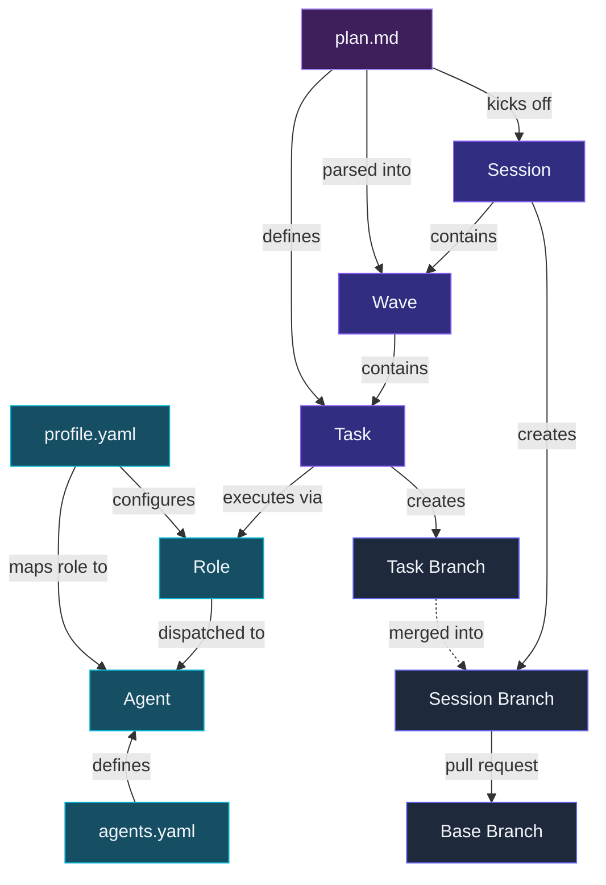

## Overview

A single `wb run` starts a **session**, which creates a session branch and groups tasks into sequential **waves**. Each **task** runs in its own isolated worktree branch, executing through a pipeline of **roles**. Which **agent** fulfills each role is determined by the active **profile**.

<DiagramContainer>



</DiagramContainer>

## Concepts

### Plan

A markdown file (e.g. `plan.md`) that describes the work to be done. Contains context, conventions, and task definitions with file ownership and dependencies. Parsed by workbench to build the task graph. See [Plans](/docs/plan-format) for details.

### Session

A single `wb run` invocation. Workbench parses the plan, creates a session branch, and executes waves sequentially until all tasks complete or fail.

### Session Branch

Where all task work is merged. Named `workbench-N` by default, or whatever you pass to `--name`. This is the branch you review and open a pull request from when the plan is done.

### Base Branch

The branch workbench starts from when creating the session branch. Defaults to `main`, or whatever you pass to `--base`. The session branch is ultimately merged back into base via a pull request.

### Wave

A group of tasks that run in parallel. Waves execute sequentially — each wave waits for the previous wave to finish and merge. Tasks within a single wave run simultaneously in isolated worktrees.

### Task

A unit of work described in the plan. Each task has a title, description, file ownership (`Files:`), and optional dependencies (`Depends:`). A task becomes an independent agent session that can only see its own description.

### Task Branch

An isolated git worktree branch created for one task. Named `wb/task-N-slug`. When a task completes successfully, its branch is merged into the session branch.

### Role

A stage in the task execution pipeline. Workbench defines five roles:

- **implementor** — writes the code
- **tester** — writes and runs tests
- **reviewer** — reviews the diff for correctness; on retry attempts, narrows to the fixer's delta and prior feedback (see [Agents](/docs/agents#reviewer))
- **fixer** — addresses failures from tester or reviewer
- **merger** — resolves merge conflicts between parallel branches

### Profile

Configuration that maps each role to an agent. Stored in `.workbench/profile.yaml`.

Profiles can also be **named** for different workflows — create `profile.<name>.yaml` and use it with `--profile-name <name>`:

```bash
wb profile init --name fast --set reviewer.agent=gemini
wb run plan.md --profile-name fast
```

This is useful when you want different agent configurations for different tasks (e.g., a `fast` profile for quick iterations, a `security` profile with stricter reviewer directives). See [Profiles](/docs/profiles) for full details.

### Agent Config

`.workbench/agents.yaml` — registers custom agent adapters so they can be used in profiles and `--agent` flags. Built-in adapters (Claude, Gemini, Codex, Cursor, Copilot) are available without any config. See [Agents](/docs/agents#custom-agents).

### Agent

The actual CLI that fulfills a role. Workbench ships with built-in adapters for some providers, and the option to add any other cli command based dispatch: 

| Name | Command | Provider |
|---|---|---|
| claude *(default)* | `claude` | Anthropic |
| gemini | `gemini` | Google |
| codex | `codex` | OpenAI |
| cursor | `agent` | Cursor |
| copilot | `copilot` | GitHub |
| &lt;other name&gt; | `cli-command` | your provider |

Claude Code is the default when no profile or `--agent` flag is specified. Custom agents can be added via `.workbench/agents.yaml` — see [Agents](/docs/agents#custom-agents).

## Execution Flow

1. `wb run plan.md` parses the plan into a task graph
2. Tasks are grouped into waves based on dependencies
3. A session branch is created from the base branch
4. For each wave:
   - Each task gets an isolated worktree and task branch
   - Each task runs through the pipeline: implement → test → review → fix
   - The role at each stage uses the agent specified in the profile
   - Successful task branches are merged into the session branch
   - Merge conflicts are resolved by the merger role
5. When all waves complete, the session branch is ready for you to review and merge

## Related

- **[Plans](/docs/plan-format)** — how to write plans with tasks, dependencies, and file ownership
- **[Running Plans](/docs/running-plans)** — monitoring, failure handling, and merging
- **[Agents](/docs/agents)** — configuring which CLIs handle each role
- **[Profiles](/docs/profiles)** — saving per-project agent configurations
