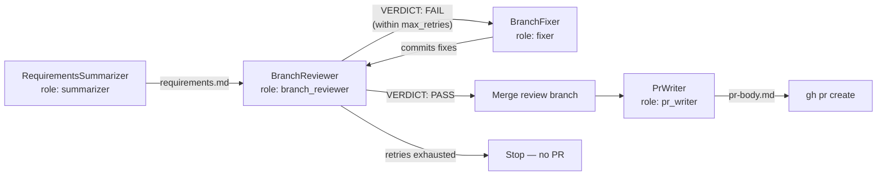

## Overview

After a session's task branches are merged, workbench can run a **final review** flow that produces
a requirements digest, iteratively reviews and fixes the session branch, and — once the review
passes — writes a pull request description and opens the PR.

This turns the end of a run into a structured handoff: a summary of what was asked for, an
independent review that loops until the code meets requirements, and a PR body that lines up with both.

## The agents

The flow runs a summarizer once, then a reviewer/fixer loop, then a PR writer on success. Each
agent has a dedicated role so you can swap models or adapters in your [profile](/docs/profiles).



1. **RequirementsSummarizer** (role `summarizer`) — reads the plan's title and `## Context` and
   produces a structured requirements digest at `wrap-up/<session>/requirements.md`.
2. **BranchReviewer** (role `branch_reviewer`) — reads the requirements plus the session branch
   diff, writes findings with file/line evidence and concrete fixes, and emits a verdict
   (`VERDICT: PASS` or `VERDICT: FAIL`) at `wrap-up/<session>/review.md`. Runs in a loop with
   the BranchFixer until a PASS is issued or `--max-retries` (default: 2) is exhausted.
3. **BranchFixer** (role `fixer`) — runs after each `VERDICT: FAIL`. Applies the reviewer's
   findings to the code on a dedicated `-review` branch. The reviewer then re-evaluates the
   updated diff on the next iteration.
4. **PrWriter** (role `pr_writer`) — runs **only if the verdict is PASS**. The review branch is
   first ff-merged back into the session branch, then the PR writer reads the plan title and
   Context, `git diff --stat`, commit subjects, and merged task titles to produce a PR title and
   body at `wrap-up/<session>/pr-body.md`. Opens the PR via `gh pr create` when the `gh` CLI is
   available; otherwise it prints a copy-pasteable command.

## Where outputs land

All three artifacts live under the per-plan workbench folder:

```
.workbench/<plan>/wrap-up/<session>/
├── requirements.md
├── review.md
└── pr-body.md
```

The outcome — verdict, file paths, PR URL, and which agents were used — is recorded under
`final_reviews` in the plan's `status.yaml`, so a run's review history stays alongside the rest of
its state.

## Running the flow

The flow can be triggered as part of a run, or standalone against an existing session.

```bash
# As part of a run, after merges complete
wb run myplan --final-review

# Standalone, against an existing session
wb final-review workbench-1        # alias: wb review
wb review workbench-1

# Merge unmerged branches, then review
wb merge -b workbench-1 --review

# Just write/open the PR (no reviewer)
wb pull-request myplan
wb pull-request myplan -b workbench-3
```

> **Tip:** `wb review` is an alias for `wb final-review` — use whichever reads better in context.

## Controlling each step

Flags let you skip stages, override the PR body, retarget the PR base, or steer an individual agent
without editing the plan.

```bash
wb run myplan --final-review --skip-pr            # review but don't open a PR
wb run myplan --final-review --pr-title "Custom title"
wb run myplan --final-review --pr-body-file body.md
wb run myplan --final-review --pr-base release    # PR targets `release`, not main

# Focus an individual agent without editing the plan:
wb run myplan --final-review --summarizer-directive "..."
wb run myplan --final-review --branch-reviewer-directive "..."
wb run myplan --final-review --pr-writer-directive "..."
```

The directive flags append guidance to the corresponding agent's prompt for this run only — handy
for one-off adjustments like "focus on security" or "explain the schema migration in the PR body."

## Related

- [CLI Reference](/docs/cli-reference) for the full flag listing on `wb run`, `wb final-review`,
  `wb merge`, and `wb pull-request`.
- [Running Plans](/docs/running-plans) for how sessions, waves, and merges work.
- [Conventions](/docs/conventions) for shared rules that the reviewer takes into account.
